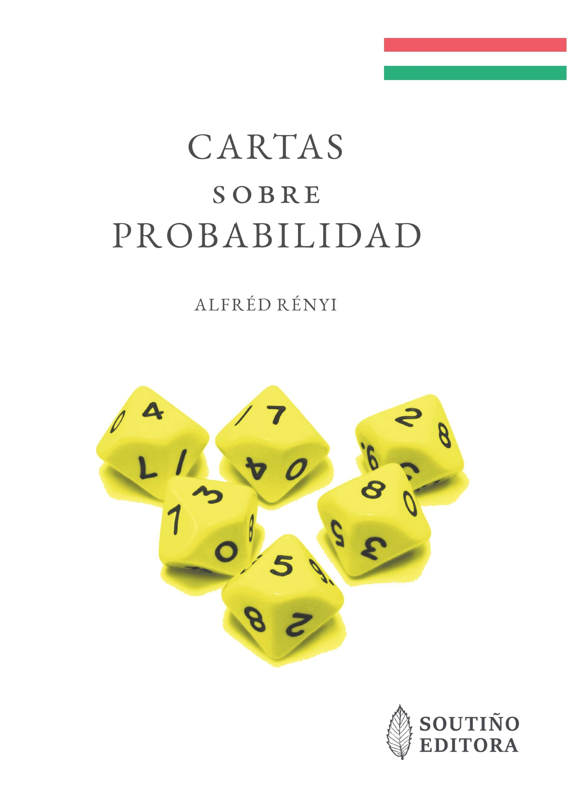

**Febrero de 2022: Cartas sobre Probabilidad (de Alfréd Rényi)**

Traducción al castellano del libro: "_Levelek a valószínűségről_" (_Cartas sobre probabilidad_) del matemático húngaro [Alfréd Rényi](https://es.wikipedia.org/wiki/Alfr%C3%A9d_R%C3%A9nyi):

- 📓 [libro_cartas_sobre_probabilidad](cartas_sobre_probabilidade_protected.pdf) (Libro completo, archivo con contraseña)
- 📎 [libro_cartas_sobre_probabilidad](cartas_sobre_probabilidade_mostra.pdf) (Primeras y últimas páginas)

ISBN: 978-84-09-43646-0 
Depósito Legal: 

Nota: Los traductores disponen del permiso de los propietarios de los derechos de autor para enviar una copia personal a profesores y alumnos interesados en esta obra. Para solicitar tu copia gratuita, escribe un correo electrónico a jlosr@unileon.es

  

En esta interesante obra, Alfréd Rényi nos muestra la probabilidad en _status nascendi_ a través de unas ficticias cartas que [Pascal](https://es.wikipedia.org/wiki/Blaise_Pascal) envía a [Fermat](https://es.wikipedia.org/wiki/Pierre_de_Fermat). El [Caballero de Meré](https://es.wikipedia.org/wiki/Antoine_Gombaud), [Damien Mitton](https://es.wikipedia.org/wiki/Damien_Mitton) o [Lucrecio](https://es.wikipedia.org/wiki/Lucrecio) nos acompañarán en esta aventura.

