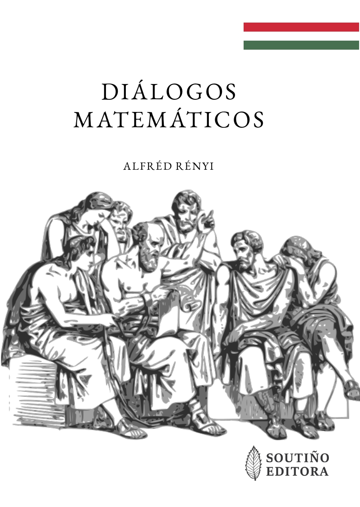

**Octubre de 2021: Diálogos Matemáticos (de Alfréd Rényi)**

Traducción al gallego del libro: "_Dialógusok a matematikáról_" (_Diálogos Matemáticos_) del matemático húngaro [Alfréd Rényi](https://es.wikipedia.org/wiki/Alfr%C3%A9d_R%C3%A9nyi):

- 📓 [libro_diálogos_matemáticos](dialogos_matematicos_protected.pdf) (Libro completo, archivo con contraseña)
- 📎 [libro_diálogos_matemáticos](dialogos_matematicos_mostra.pdf) (Primeras y últimas páginas)

ISBN: 978-84-09-35555-6 
Depósito Legal: C 1917-2021

Nota: Los traductores disponen del permiso de los propietarios de los derechos de autor para enviar una copia personal a profesores y alumnos interesados en esta obra. Para solicitar tu copia gratuita, escribe un correo electrónico a jlosr@unileon.es

  

- Personajes del primer diálogo: [Sócrates](https://es.wikipedia.org/wiki/S%C3%B3crates) e [Hipócrates](https://es.wikipedia.org/wiki/Hip%C3%B3crates_de_Qu%C3%ADos) 
- Personajes del segundo diálogo: [Arquímedes](https://es.wikipedia.org/wiki/Arqu%C3%ADmedes) y el [Rey Hierón II](https://es.wikipedia.org/wiki/Hier%C3%B3n_II) 
- Personajes del tercer diálogo: [Galileo Galilei](https://es.wikipedia.org/wiki/Galileo_Galilei), [Torricelli](https://es.wikipedia.org/wiki/Evangelista_Torricelli) y la [Sra. Niccolini](https://brunelleschi.imss.fi.it/itineraries/biography/FrancescoNiccolini.html)

