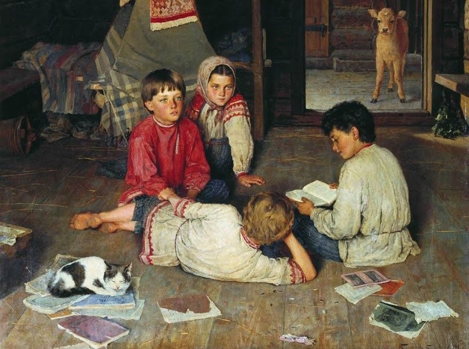
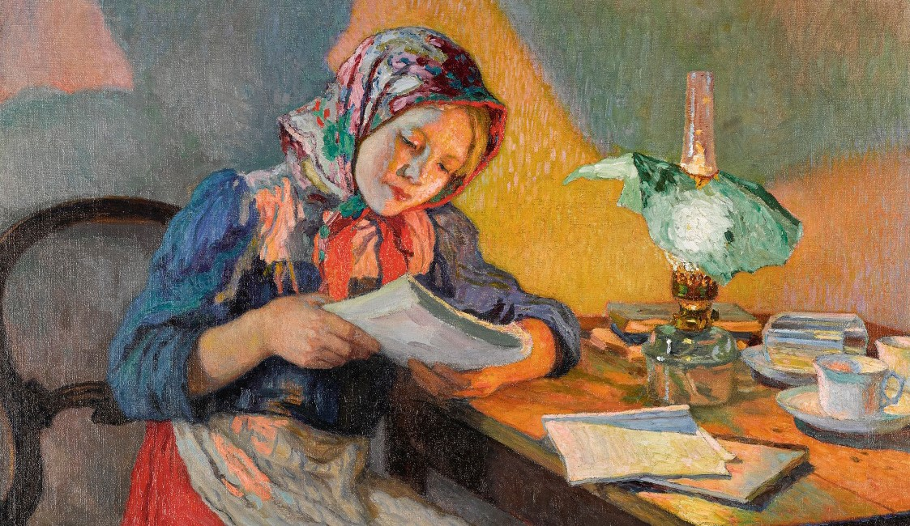

# Matemática Magyar 

"_Is there any virtue in adding new topics to the Elementary School Math Curriculum? Is it not more important to teach a limited number of time-honoured topics in a meaningful way, than to cram curriculum with too much stuff, risking to neglect the essentials?_"

 

"_Que la enseñanza de las matemáticas sea tal que desarrolle en el alumno la conciencia de la importancia cultural de las matemáticas. No es nuestro objetivo proporcionar más conocimientos matemáticos a los alumnos que vayan a recibir más formación técnica o especializada; nuestro objetivo es equipar precisamente a aquellos alumnos cuya formación en matemáticas llegará a su fin al graduarse de la escuela secundaria con una comprensión de las matemáticas que sea digna de una ciencia tan grande._"

Un póster a modo de declaración de intenciones:
-  📎 [Matemáticas "_a la húngara_" para Secundaria y Bachillerato](poster.pdf) 

Todos los **materiales** que se muestran a continuación han sido **diseñados para estudiantes, no para profesores**.

Unos cuantos libros para disfrutar de las matemáticas "_a la húngara_":

- 📓 [Abril de 2021: Jugando con el Infinito (de Rózsa Péter)](jugando_con_el_infinito.md) 
- 📓 [Octubre de 2021: Diálogos Matemáticos (de Alfréd Rényi)](dialogos_matematicos.md) 
- 📓 [Febrero de 2022: Cartas sobre Probabilidad (de Alfréd Rényi)](cartas_sobre_probabilidad.md) 
- 📓 [Agosto de 2022: Las matemáticas en tela de juicio (de Béla Andrásfai)](matematicas_en_tela_de_juicio.md) 

**Humor...**

No podemos despedirnos sin un poco de humor, pues tal y como dijo [Frigyes Karinthy](https://es.wikipedia.org/wiki/Frigyes_Karinthy):

<em>cuando se trata de humor, ¡no admito bromas!</em>

Nosotros tampoco.

- 📎 [Eureka!](eureka.pdf) (La verdadera historia de Arquímedes)
- 📎 [Ayudo a mi hijo](ayudo_a_mi_hijo.pdf) (No apto para gente que odia la regla de tres)
- 📎 [El uno y la nada](el_uno_y_la_nada.pdf) (Sólo para aquellos que descubrieron el continuo)
- Continuará...  (No sin tu interés)

 

