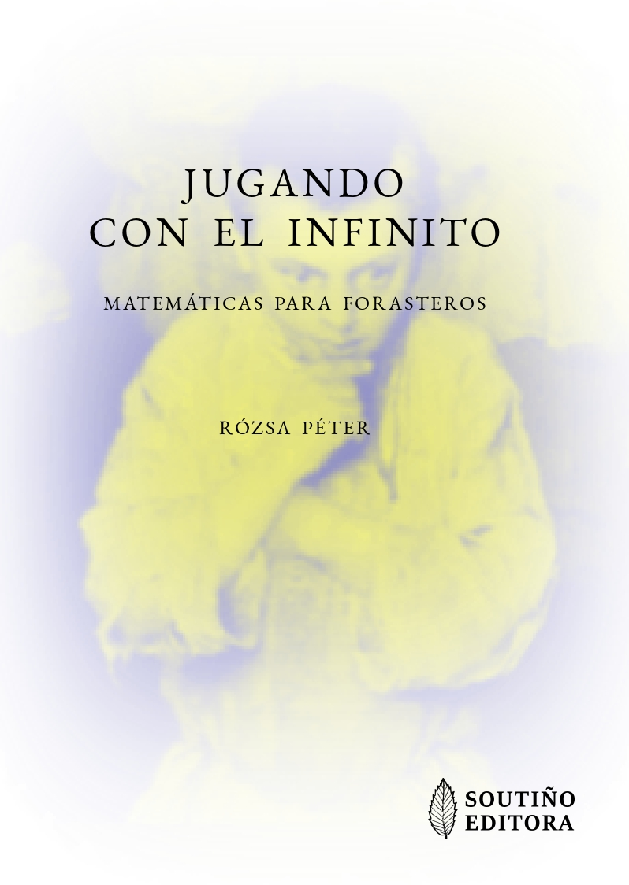

# Documentos 

**Abril de 2021: Jugando con el Infinito (de Rózsa Péter)**

Traducción al castellano del libro: "_Játék a végtelennel: Matematika kívülállóknak_" (_Jugando con el Infinito: matemáticas para forasteros_) de la matemática húngara [Rózsa Péter](https://es.wikipedia.org/wiki/R%C3%B3zsa_P%C3%A9ter):

- [libro_jugando_con_el_infinito](libro_xogando_co_infinito_protegido.pdf) (Libro completo, archivo con contraseña)
- [libro_jugando_con_el_infinito](libro_xogando_co_infinito_mostra.pdf) (Prefacio, Capítulo 1, Capítulo 2 y Capítulo 22)

ISBN: 978-84-09-30916-0
Depósito Legal: C 838-2021

Nota: Los traductores disponen del permiso de los propietarios de los derechos de autor para enviar una copia personal a profesores y alumnos interesados en esta obra. Para solicitar tu copia gratuita, escribe un correo electrónico a jorge.losada@usc.es  

**Octubre de 2021: Diálogos Matemáticos (de Alfréd Rényi)**

Traducción al gallego del libro: "_Dialógusok a matematikáról_" (_Diálogos Matemáticos_) de la matemática húngara [Alfréd Rényi](https://es.wikipedia.org/wiki/Alfr%C3%A9d_R%C3%A9nyi):

- [libro_diálogos_matemáticos](libro_dialogos_matematicos_protected.pdf) (Libro completo, archivo con contraseña)
- [libro_diálogos_matemáticos](libro_dialogos_matematicos_protected.pdf) (Primeras y últimas páginas)

ISBN: ???-??-??-?????-?
Depósito Legal: ? ???-????

Nota: Los traductores todavía no disponen del permiso de los propietarios de los derechos de autor para enviar copias personales a profesores y alumnos interesados en esta obra. Para recibir información sobre esta obra, escribe un correo electrónico a jorge.losada@usc.es

