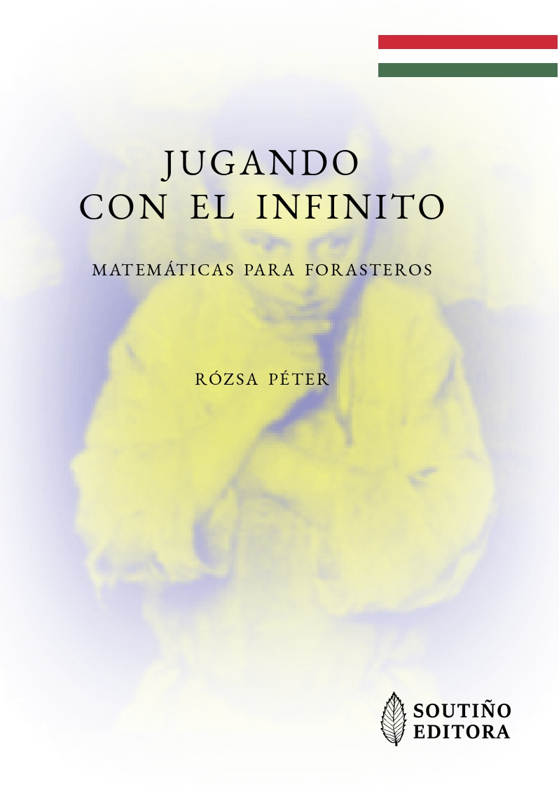
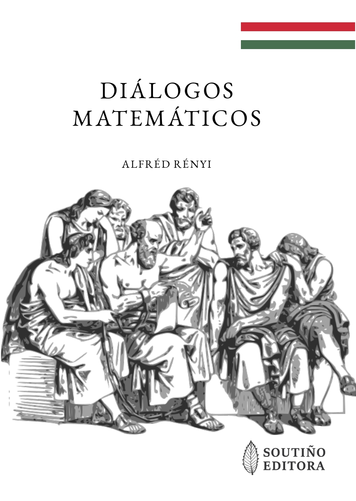
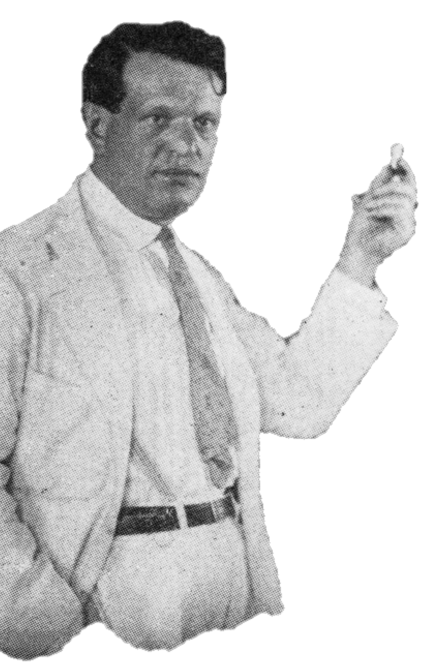

# "Matemática Magyar" 

"_Que la enseñanza de las matemáticas sea tal que desarrolle en el alumno la conciencia de la importancia cultural de las matemáticas. No es nuestro objetivo proporcionar más conocimientos matemáticos a los alumnos que vayan a recibir más formación técnica o especializada; nuestro objetivo es equipar precisamente a aquellos alumnos cuya formación en matemáticas llegará a su fin al graduarse de la escuela secundaria con una comprensión de las matemáticas que sea digna de una ciencia tan grande._"

Un póster a modo de declaración de intenciones:
-  📎 [Matemáticas "_a la húngara_" para Secundaria y Bachillerato](poster_jornada_innovacion_docente (1).pdf) 

Todos los **materiales** que se muestran a continuación han sido **diseñados para estudiantes, no para profesores**.

**Abril de 2021: Jugando con el Infinito (de Rózsa Péter)**

Traducción al castellano del libro: "_Játék a végtelennel: Matematika kívülállóknak_" (_Jugando con el Infinito: matemáticas para forasteros_) de la matemática húngara [Rózsa Péter](https://es.wikipedia.org/wiki/R%C3%B3zsa_P%C3%A9ter):

- 📓 [libro_jugando_con_el_infinito](xogando_co_infinito_protected.pdf) (Libro completo, archivo con contraseña)
- 📎 [libro_jugando_con_el_infinito](xogando_co_infinito_mostra.pdf) (Prefacio, Capítulos 1, 2 y 22)

ISBN: 978-84-09-30916-0 
Depósito Legal: C 838-2021

Nota: Los traductores disponen del permiso de los propietarios de los derechos de autor para enviar una copia personal a profesores y alumnos interesados en esta obra. Para solicitar tu copia gratuita, escribe un correo electrónico a jlosr@unileon.es

  

 

Añadimos aquí un breve pero interesante ejemplo que muestra una de las características principales del "_método húngaro_": el aprendizaje por descubrimiento.
- 📎 [En el aula con Rózsa Péter: m.c.d.(116,36)](mcd_116_36.pdf)

**Octubre de 2021: Diálogos Matemáticos (de Alfréd Rényi)**

Traducción al gallego del libro: "_Dialógusok a matematikáról_" (_Diálogos Matemáticos_) del matemático húngaro [Alfréd Rényi](https://es.wikipedia.org/wiki/Alfr%C3%A9d_R%C3%A9nyi):

- 📓 [libro_diálogos_matemáticos](dialogos_matematicos_protected.pdf) (Libro completo, archivo con contraseña)
- 📎 [libro_diálogos_matemáticos](mcd.pdf) (Primeras y últimas páginas)

ISBN: 978-84-09-35555-6 
Depósito Legal: C 1917-2021

Nota: Los traductores disponen del permiso de los propietarios de los derechos de autor para enviar una copia personal a profesores y alumnos interesados en esta obra. Para solicitar tu copia gratuita, escribe un correo electrónico a jlosr@unileon.es

  

- Personajes del primer diálogo: [Sócrates](https://es.wikipedia.org/wiki/S%C3%B3crates) e [Hipócrates](https://es.wikipedia.org/wiki/Hip%C3%B3crates_de_Qu%C3%ADos) 
- Personajes del segundo diálogo: [Arquímedes](https://es.wikipedia.org/wiki/Arqu%C3%ADmedes) y el [Rey Hierón II](https://es.wikipedia.org/wiki/Hier%C3%B3n_II) 
- Personajes del tercer diálogo: [Galileo Galilei](https://es.wikipedia.org/wiki/Galileo_Galilei), [Torricelli](https://es.wikipedia.org/wiki/Evangelista_Torricelli) y la [Sra. Niccolini](https://brunelleschi.imss.fi.it/itineraries/biography/FrancescoNiccolini.html)

**En el futuro...**

- Las matemáticas a juicio (obra de teatro del Prof. Béla Andrásfai) 
- Algunos textos matemáticos de un autor (húngaro) por desvelar 

 

