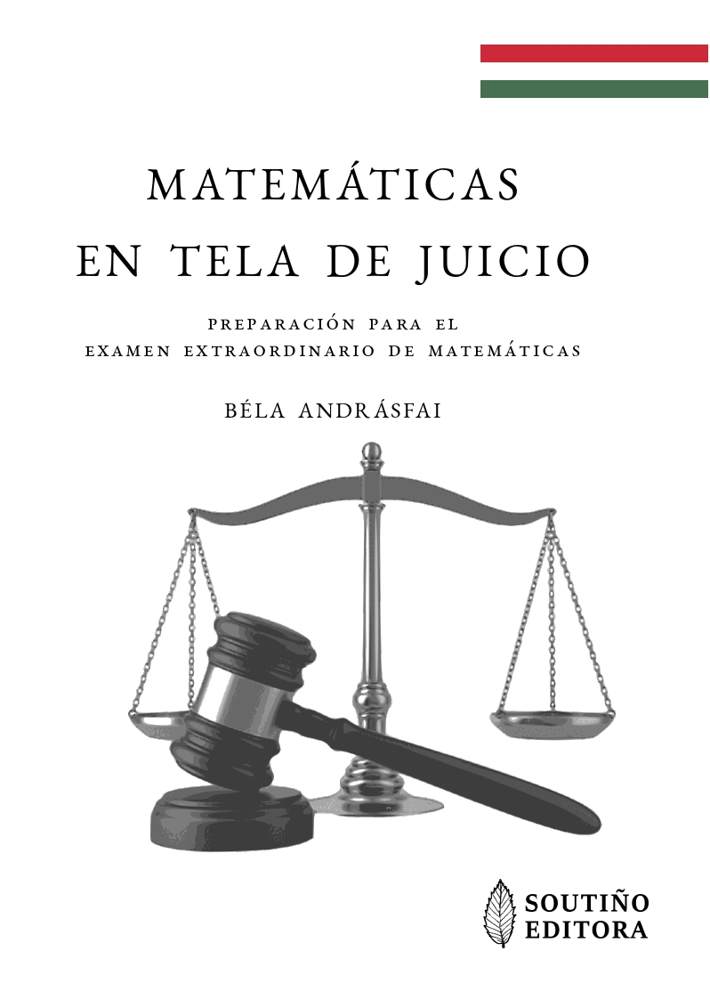

**Agosto de 2022: Las matemáticas en tela de juicio (de Béla Andrásfai)**

Traducción al castellano del libro: "_Matematika a vádlottak padján_" (_Matemáticas en tela de juicio_) del matemático húngaro [Béla Andrásfai](https://en.wikipedia.org/wiki/B%C3%A9la_Andr%C3%A1sfai):

- 📓 [libro_matemáticas_tela_juicio](matematicas_juicio_protected.pdf) (Libro completo, archivo con contraseña)
- 📎 [libro_matematicas_tela_juicio](matematicas_juicio_mostra.pdf) (Primeras y última página)

ISBN: 978-84-09-43790-0 
Depósito Legal: 

Nota: Los traductores disponen del permiso de los propietarios de los derechos de autor para enviar una copia personal a profesores y alumnos interesados en esta obra. Para solicitar tu copia gratuita, escribe un correo electrónico a jlosr@unileon.es

  

En esta divertida obra de teatro, [Béla Andrásfai](https://en.wikipedia.org/wiki/B%C3%A9la_Andr%C3%A1sfai) lleva a juicio a las matemáticas. El elevado número de personajes facilita su representación en el aula o durante un [guateque](https://www.youtube.com/watch?v=2gnC_qfP6Iw) con [colegas](https://www.youtube.com/watch?v=arC--h39GuU). 

